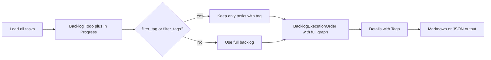

# Tag-aware task execution plan

## Context

**exarp-go is an MCP server.** The task_analysis and task_workflow tools are exposed via MCP (e.g. to Cursor and other MCP clients), as well as via the CLI. Tag-aware execution planning will be available to both: MCP clients call `task_analysis` with `action=execution_plan` and `filter_tag`/`filter_tags`; CLI users can use `exarp-go task list --tag <tag> --order execution` or a future `task plan` wrapper.

---

## Current state

- **Listing:** [internal/cli/task.go](internal/cli/task.go) and [internal/tools/task_workflow_common.go](internal/tools/task_workflow_common.go) support `--tag` / `filter_tag` and `order=execution`. You can get a tag-filtered, dependency-ordered list today:
  - `exarp-go task list --tag migration --order execution`
  - `task_workflow` with `action=sync`, `sub_action=list`, `filter_tag`, `order=execution`
- **Execution plan:** [internal/tools/task_analysis_shared.go](internal/tools/task_analysis_shared.go) `handleTaskAnalysisExecutionPlan` loads all tasks, runs [BacklogExecutionOrder](internal/tools/graph_helpers.go) on the full backlog (Todo + In Progress). It has **no** tag filter and **no** tags in the output.
- **BacklogExecutionOrder** in [internal/tools/graph_helpers.go](internal/tools/graph_helpers.go) (lines 557–610) takes a task slice and returns dependency-ordered backlog; it does not filter by tag. [BacklogTaskDetail](internal/tools/graph_helpers.go) has `ID`, `Content`, `Priority`, `Status`, `Level` — no `Tags`.
- **Canonical tag set** is defined in [.cursor/rules/code-and-planning-tag-hints.mdc](.cursor/rules/code-and-planning-tag-hints.mdc) (e.g. `#migration`, `#cli`, `#bug`, `#testing`).

## Goal

- Execution plan should be **scopable by tag(s)** (e.g. "plan for #migration only").
- Plan output should **show tags** per task so executors see which tag each task has.
- Document the **workflow** for "plan and execute by tag" for both **MCP clients** and **CLI** users.

## Implementation

### 1. Add tag filter to execution plan

**File:** [internal/tools/task_analysis_shared.go](internal/tools/task_analysis_shared.go) — `handleTaskAnalysisExecutionPlan` (around 1914–1926).

- After loading all tasks, optionally filter to backlog tasks that have a given tag (or any of several tags).
- Support:
  - **Single tag:** `filter_tag` (string) — keep only backlog tasks that have this tag.
  - **Multiple tags (OR):** `filter_tags` (string, comma-separated, or JSON array) — keep backlog tasks that have at least one of these tags.
- If neither is set, behavior unchanged (full backlog).
- Build backlog as today (Todo + In Progress), then if `filter_tag` or `filter_tags` is set, filter that backlog slice by tag(s) before calling `BacklogExecutionOrder`. Pass the **full** task set into `BuildTaskGraph` / `GetTaskLevels` so dependency levels are correct; only the backlog slice used for ordering should be tag-filtered.

### 2. Include tags in execution plan output

**File:** [internal/tools/graph_helpers.go](internal/tools/graph_helpers.go).

- Extend `BacklogTaskDetail` with `Tags []string` (or a single string for display, e.g. comma-joined). Populate it when building `details` in `BacklogExecutionOrder` from each task's `Tags` field.

**File:** [internal/tools/task_analysis_shared.go](internal/tools/task_analysis_shared.go).

- In `formatExecutionPlanMarkdown`, add a "Tags" column to the waves table and show each task's tags (e.g. `#migration`, `#cli`). Ensure the JSON result for `details` includes the new `tags` field for API consumers (including MCP callers).

### 3. Register new parameters in schema and registry

**File:** [internal/tools/registry.go](internal/tools/registry.go) — task_analysis tool schema.

- Add optional `filter_tag` (string) and `filter_tags` (string, comma-separated) to the tool schema, documented as "For action=execution_plan: restrict backlog to tasks with this tag / any of these tags."

**File:** MCP descriptor (e.g. exarp-go MCP server's task_analysis tool descriptor). If the schema is generated from Go, ensure the new params are in the struct/tag that drives the descriptor; otherwise add them to the JSON so MCP clients see the new arguments.

### 4. Optional: group by tag in output

- If **not** filtering by tag, optionally add a "Group by tag" mode: output sections like "## Tag: migration", "## Tag: bug", with tasks listed under each. This is a follow-up; the minimal scope is filter + show tags.

### 5. Document workflow (MCP + CLI)

**File:** New or existing doc under `docs/` (e.g. `docs/TASK_EXECUTION_BY_TAG.md` or a section in an existing task/workflow doc).

- **MCP clients (exarp-go as MCP server):** Call `task_analysis` with `action=execution_plan`, optional `filter_tag` or `filter_tags`, and optional `output_path` to get a written plan. Plan output will include a Tags column.
- **CLI — quick list by tag in execution order:**  
  `exarp-go task list --tag <tag> --order execution` (and optional `--limit`).
- **CLI — written plan (if wrapper added):**  
  e.g. `exarp-go task plan --tag <tag> --output docs/execution-migration.md` (thin wrapper around task_analysis execution_plan).
- **Full backlog plan (unchanged):**  
  `task_analysis` with `action=execution_plan`, no filter; plan now includes a Tags column.
- Reference the canonical tag set from [code-and-planning-tag-hints.mdc](.cursor/rules/code-and-planning-tag-hints.mdc).

## Data flow (tag-filtered execution plan)

## Files to touch

| File | Change |
|------|--------|
| [internal/tools/task_analysis_shared.go](internal/tools/task_analysis_shared.go) | In `handleTaskAnalysisExecutionPlan`: parse `filter_tag` / `filter_tags`, filter backlog by tag(s) before ordering; ensure details + markdown include tags. |
| [internal/tools/graph_helpers.go](internal/tools/graph_helpers.go) | Add `Tags` to `BacklogTaskDetail`; fill it in `BacklogExecutionOrder`. |
| [internal/tools/registry.go](internal/tools/registry.go) | Add `filter_tag` and `filter_tags` to task_analysis schema. |
| MCP task_analysis descriptor | Add same params if not generated from Go. |
| `docs/` | Add short doc for execution-by-tag workflow (MCP + CLI). |

## Testing

- Unit test: backlog filtered by `filter_tag` only includes tasks with that tag; order still respects dependencies.
- Unit test: `filter_tags` with two tags includes tasks that have either tag.
- Regression: execution_plan with no filter produces same backlog count as before and new `details[].tags` present.
- Manual: generate a plan with `filter_tag=migration` via MCP tool call and via CLI (if wrapper exists); confirm markdown has a Tags column and only migration-tagged backlog tasks.

## Out of scope

- Changing how dependencies or levels are computed (still use full task set for graph).
- CLI subcommand like `exarp-go task plan --tag X` (can be added later as a thin wrapper around task_analysis execution_plan).
- Tag-based **priority** or ordering (e.g. "do all #bug before #feature"); ordering remains dependency then priority then ID.
