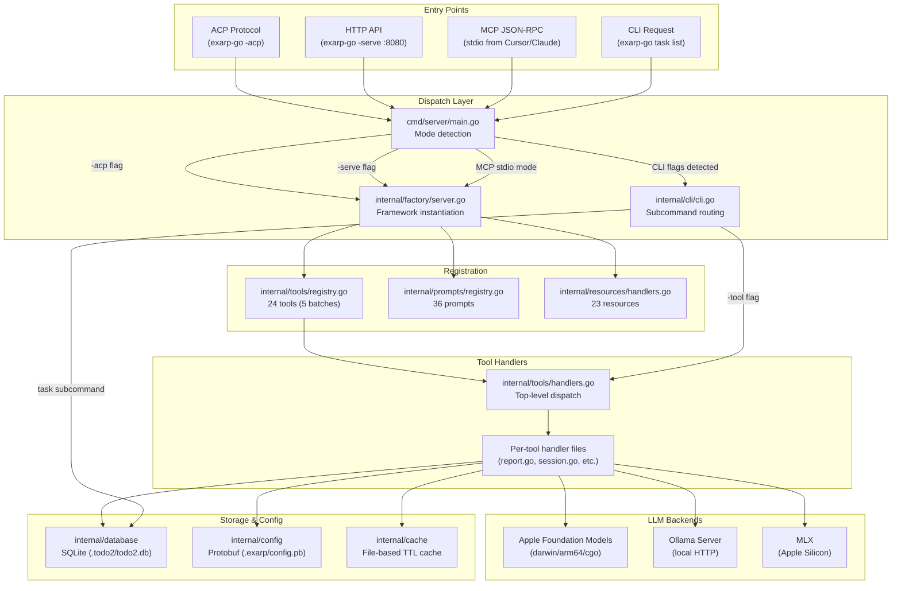

# exarp-go Architecture

**Tag hints:** `#docs` `#refactor`

> A Go-based MCP (Model Context Protocol) server providing 24 tools, 36 prompts, and 23 resources
> for AI-assisted project management, code quality, and local LLM integration.

## Package Map

| Package | Responsibility | Key Files |
|---|---|---|
| `cmd/server` | Binary entry point: CLI dispatch, MCP stdio, HTTP API, ACP server | `main.go` |
| `internal/acp` | Agent Client Protocol adapter (Zed, JetBrains, OpenCode) | `server.go` |
| `internal/api` | HTTP REST API for PWA UI | `server.go` |
| `internal/archive` | Archived/deprecated code | — |
| `internal/cache` | File-based caching (scorecard, reports) with TTL | `file_cache.go` |
| `internal/cli` | CLI subcommands + Bubbletea TUI + IBM 3270 TUI | `cli.go`, `tui*.go`, `tui3270*.go`, `task.go` |
| `internal/config` | Protobuf-based project configuration (`.exarp/config.pb`) | `loader.go`, `schema.go`, `writer.go` |
| `internal/database` | SQLite storage: tasks, comments, activities, locks, migrations | `tasks_crud.go`, `tasks_list.go`, `locking.go`, `schema.go` |
| `internal/factory` | MCP server factory (creates framework instances from config) | `server.go` |
| `internal/framework` | MCP server interface abstraction (re-exports from mcp-go-core) | `server.go` |
| `internal/logging` | Structured logging (slog-based) | `logger.go` |
| `internal/models` | Shared types and constants (no DB dependency) | `todo2.go`, `constants.go`, `task_id.go` |
| `internal/platform` | Platform-specific utilities (darwin detection, etc.) | — |
| `internal/projectroot` | Project root detection (go.mod, .git, .exarp) | — |
| `internal/prompts` | MCP prompt definitions and registration | `registry.go` |
| `internal/queue` | Redis + Asynq job queue for wave execution | `producer.go`, `worker.go`, `config.go` |
| `internal/resources` | MCP resource handlers (`stdio://` URIs) | `handlers.go`, `tasks.go`, `tools.go` |
| `internal/security` | Rate limiting, path validation, vulnerability scanning | `ratelimit.go`, `scanner.go` |
| `internal/taskanalysis` | Graph-based task analysis (gonum) | — |
| `internal/tasksync` | Cross-project task synchronization | — |
| `internal/tools` | All MCP tool handlers (business logic) — largest package | `handlers.go`, `registry.go`, 50+ handler files |
| `internal/utils` | Small shared utilities | — |
| `internal/web` | Embedded PWA UI + SPA handler | — |

## Data Flow



## Entry Points

| Entry Point | File | Purpose |
|---|---|---|
| CLI dispatch or MCP stdio | `cmd/server/main.go` | Detects mode from flags/TTY, routes to CLI or MCP server |
| CLI subcommand routing | `internal/cli/cli.go` | Parses `-tool`, `task`, `tui`, `config` subcommands |
| MCP tool dispatch | `internal/tools/handlers.go` | Routes JSON-RPC tool calls to per-tool handler functions |
| Tool registration | `internal/tools/registry.go` | Registers 24 tools in 5 batches with schemas |
| HTTP API + PWA | `internal/api/server.go` + `internal/web/` | REST API wrapping MCP tools; embedded SPA |
| ACP server | `internal/acp/server.go` | Agent Client Protocol for Zed/JetBrains/OpenCode |

## Key Abstractions

| Abstraction | Location | Purpose |
|---|---|---|
| `framework.MCPServer` | `internal/framework/server.go` | MCP server interface (RegisterTool, RegisterResource, Run) |
| `framework.ToolHandler` | `internal/framework/server.go` | `func(ctx, json.RawMessage) ([]TextContent, error)` |
| `models.Todo2Task` | `internal/models/todo2.go` | Canonical task struct used across all packages |
| `models.Status*` / `Priority*` | `internal/models/constants.go` | Named constants for statuses, priorities, comment types |
| `database.TaskStore` | `internal/database/tasks_crud.go` | CRUD operations: GetTask, CreateTask, UpdateTask, DeleteTask |
| `database.ClaimTaskForAgent` | `internal/database/locking.go` | Distributed lock acquisition for multi-agent safety |
| `config.FullConfig` | `internal/config/schema.go` | Protobuf-based project configuration |
| `TextGenerator` interface | `internal/tools/text_generate.go` | LLM provider contract (FM, Ollama, MLX, LocalAI) |
| `cache.ScorecardCache` | `internal/cache/file_cache.go` | TTL-based cache for expensive scorecard computation |

## Tool Handler Pattern

Every MCP tool follows a consistent pattern:

```
handlers.go (dispatch)  →  <tool>_native.go (entry)  →  <tool>_common.go (shared logic)
                                                     →  <tool>_provider.go (external service)
```

1. **`handlers.go`**: Top-level dispatch function per tool. Parses protobuf/JSON args, applies defaults, routes to native handler.
2. **`*_native.go`**: Platform-specific entry point (action switch). Files ending `_nocgo.go` provide stubs for non-CGO builds.
3. **`*_common.go`**: Shared business logic that works across native/bridge implementations.
4. **`*_provider.go`**: External service clients (Ollama HTTP, MLX bridge, etc.).

## Adding a New Tool

1. **Create handler file** in `internal/tools/`:
   - Name it `<tool_name>.go` (or `<tool_name>_native.go` if platform-specific)
   - Add file-level orientation comment
   - Implement handler function: `func handle<ToolName>(ctx context.Context, args json.RawMessage) ([]framework.TextContent, error)`

2. **Register in `registry.go`**:
   - Add to the appropriate `registerBatchNTools()` function
   - Provide tool name, description (with `[HINT: ...]`), JSON schema, and handler reference
   - Update the batch comment with new tool count

3. **Add protobuf support** (optional):
   - Define request/response in `proto/*.proto`
   - Add `Parse<ToolName>Request()` and `<ToolName>RequestToParams()` in `protobuf_helpers.go`

4. **Update counts and tests**:
   - Update tool count in `registry.go` batch comment
   - Add to expected tool list in `internal/tools/registry_test.go`
   - Run `make sanity-check` to verify counts

5. **Update code-map**:
   - Add entry to `.cursor/rules/code-map.mdc` tool table

## Storage Architecture

```
.todo2/
├── todo2.db              # Primary: SQLite database (schema v8)
└── state.todo2.json      # Fallback: Legacy JSON (auto-migration available)

.exarp/
└── config.pb             # Project config (protobuf binary)
```

- **Database-first**: All task operations go through `internal/database` (SQLite with WAL mode)
- **JSON fallback**: `LoadTodo2Tasks()` / `SaveTodo2Tasks()` auto-detect and fall back to JSON if DB unavailable
- **Migrations**: `internal/database/migrations/*.sql` — applied automatically on Init
- **Locking**: `database.ClaimTaskForAgent()` provides lease-based distributed locks for multi-agent safety

## LLM Integration

The project supports multiple local LLM backends through a unified abstraction:

| Backend | Tool | Build Constraint | Provider |
|---|---|---|---|
| Apple Foundation Models | `apple_foundation_models` | `darwin && arm64 && cgo` | `DefaultFMProvider()` |
| Ollama | `ollama` | None (HTTP client) | `DefaultOllama()` |
| MLX | `mlx` | None (bridge) | `handleMlxNative()` |
| Auto-router | `text_generate` | None | `model_router.go` |

The `text_generate` tool with `provider=auto` uses `model_router.go` to select the best available backend.

## File Split Candidates

The following large files are candidates for future splitting (tracked as documentation, not urgent):

| File | Lines | Suggested Split |
|---|---|---|
| `task_analysis_shared.go` | ~3,991 | Extract graph algorithms, duplicate detection, dependency analysis |
| `task_workflow_common.go` | ~2,729 | Extract CRUD helpers, batch operations, AI integration |
| `report.go` | ~2,288 | Extract scorecard dispatch, overview/briefing helpers |
| `session.go` | ~2,193 | Extract handoff operations into `session_handoff.go` |
| `registry.go` | ~1,962 | Extract per-batch registration into separate files |
| `protobuf_helpers.go` | ~1,722 | Extract per-tool parse/convert pairs |
| `database/tasks.go` | ~1,500+ | Already split into `tasks_crud.go`, `tasks_list.go`, etc. |

These are documented for reference. Splits should be done incrementally with full test coverage verification (`make test`) after each split.
