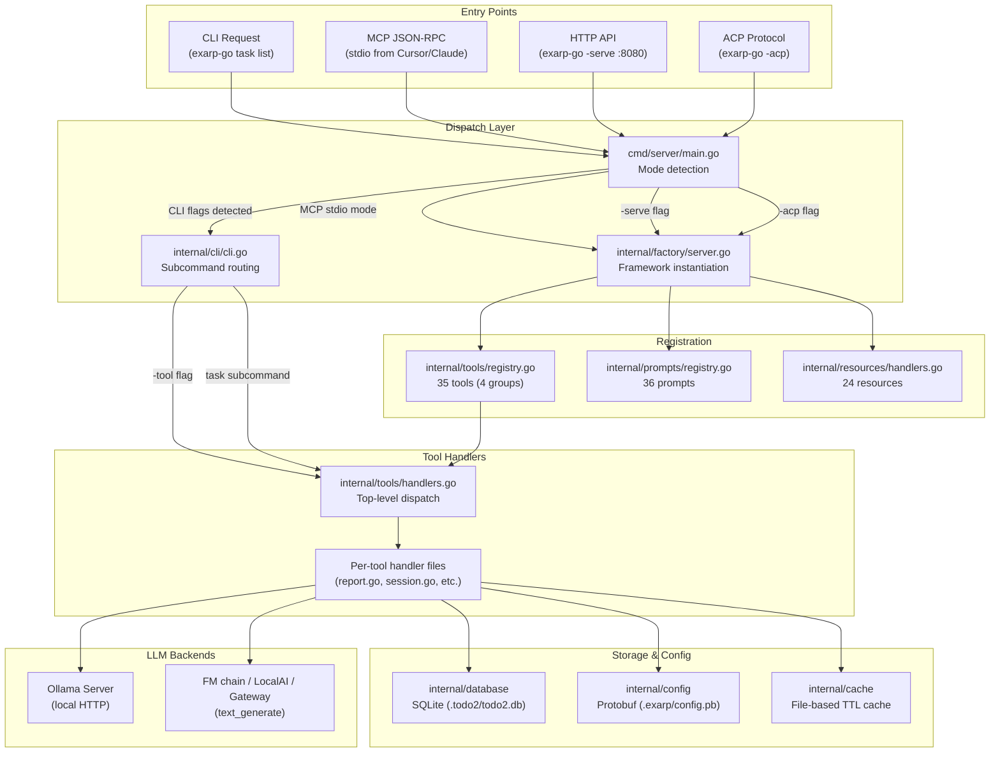

# exarp-go Architecture

**Tag hints:** `#docs` `#refactor`

> A Go-based MCP (Model Context Protocol) server providing native tools, prompts, and resources
> for AI-assisted project management, code quality, and local LLM integration.

## Package Map

For **modularization targets** (exarp-go vs `mcp-go-core` vs optional MCP splits), see **[MODULARIZATION_PACKAGE_MAP.md](./MODULARIZATION_PACKAGE_MAP.md)**.

| Package | Responsibility | Key Files |
|---|---|---|
| `cmd/server` | Binary entry point: CLI dispatch, MCP stdio, HTTP API, ACP server | `main.go` |
| `internal/acp` | Agent Client Protocol adapter (Zed, JetBrains, OpenCode) | `server.go` |
| `internal/api` | HTTP REST API for PWA UI | `server.go` |
| `internal/archive` | Archived/deprecated code | — |
| `internal/cache` | File-based caching (scorecard, reports) with TTL | `file_cache.go` |
| `internal/cli` | CLI subcommands + Bubbletea TUI + IBM 3270 TUI | `cli.go`, `tui*.go`, `tui3270*.go`, `task.go` |
| `internal/config` | Protobuf-based project configuration (`.exarp/config.pb`) | `loader.go`, `schema.go`, `writer.go` |
| `internal/database` | SQLite storage: tasks, comments, activities, locks, migrations | `tasks_crud.go`, `tasks_list.go`, `locking.go`, `schema.go` |
| `internal/factory` | MCP server factory (creates framework instances from config) | `server.go` |
| `internal/framework` | MCP server interface abstraction (re-exports from mcp-go-core) | `server.go` |
| `internal/logging` | Structured logging (slog-based) | `logger.go` |
| `internal/models` | Shared types and constants (no DB dependency) | `todo2.go`, `constants.go`, `task_id.go` |
| `internal/platform` | Platform-specific utilities (darwin detection, etc.) | — |
| `internal/projectroot` | Project root detection (go.mod, .git, .exarp) | — |
| `internal/prompts` | MCP prompt definitions and registration | `registry.go` |
| `internal/queue` | Redis + Asynq job queue for wave execution | `producer.go`, `worker.go`, `config.go` |
| `internal/resources` | MCP resource handlers (`stdio://` URIs) | `handlers.go`, `tasks.go`, `tools.go` |
| `internal/security` | Rate limiting, path validation, vulnerability scanning | `ratelimit.go`, `scanner.go` |
| `internal/taskanalysis` | Graph-based task analysis (gonum) | — |
| `internal/tasksync` | Cross-project task synchronization | — |
| `internal/tools` | All MCP tool handlers (business logic) — largest package | `handlers.go`, `registry.go`, 50+ handler files |
| `internal/utils` | Small shared utilities | — |
| `internal/web` | Embedded PWA UI + SPA handler | — |

## Data Flow


```mermaid
flowchart TD
    subgraph Entry["Entry Points"]
        CLI["CLI Request<br/>(exarp-go task list)"]
        MCP["MCP JSON-RPC<br/>(stdio from Cursor/Claude)"]
        HTTP["HTTP API<br/>(exarp-go -serve :8080)"]
        ACP_IN["ACP Protocol<br/>(exarp-go -acp)"]
    end

    subgraph Dispatch["Dispatch Layer"]
        MAIN["cmd/server/main.go<br/>Mode detection"]
        CLI_DISPATCH["internal/cli/cli.go<br/>Subcommand routing"]
        FACTORY["internal/factory/server.go<br/>Framework instantiation"]
    end

    subgraph Registration["Registration"]
        TOOLS_REG["internal/tools/registry.go<br/>35 tools (4 groups)"]
        PROMPTS_REG["internal/prompts/registry.go<br/>36 prompts"]
        RESOURCES_REG["internal/resources/handlers.go<br/>24 resources"]
    end

    subgraph Handlers["Tool Handlers"]
        HANDLERS["internal/tools/handlers.go<br/>Top-level dispatch"]
        TOOL_IMPL["Per-tool handler files<br/>(report.go, session.go, etc.)"]
    end

    subgraph Storage["Storage & Config"]
        DB["internal/database<br/>SQLite (.todo2/todo2.db)"]
        CONFIG["internal/config<br/>Protobuf (.exarp/config.pb)"]
        CACHE["internal/cache<br/>File-based TTL cache"]
    end

    subgraph LLM["LLM Backends"]
        OLLAMA["Ollama Server<br/>(local HTTP)"]
        FMCHAIN["FM chain / LocalAI / Gateway<br/>(text_generate)"]
    end

    CLI --> MAIN
    MCP --> MAIN
    HTTP --> MAIN
    ACP_IN --> MAIN

    MAIN -->|"CLI flags detected"| CLI_DISPATCH
    MAIN -->|"MCP stdio mode"| FACTORY
    MAIN -->|"-serve flag"| FACTORY
    MAIN -->|"-acp flag"| FACTORY

    FACTORY --> TOOLS_REG
    FACTORY --> PROMPTS_REG
    FACTORY --> RESOURCES_REG

    CLI_DISPATCH -->|"-tool flag"| HANDLERS
    CLI_DISPATCH -->|"task subcommand"| HANDLERS
    TOOLS_REG --> HANDLERS
    HANDLERS --> TOOL_IMPL

    TOOL_IMPL --> DB
    TOOL_IMPL --> CONFIG
    TOOL_IMPL --> CACHE
    TOOL_IMPL --> OLLAMA
    TOOL_IMPL --> FMCHAIN
```

## Entry Points

| Entry Point | File | Purpose |
|---|---|---|
| CLI dispatch or MCP stdio | `cmd/server/main.go` | Detects mode from flags/TTY, routes to CLI or MCP server |
| CLI subcommand routing | `internal/cli/cli.go` | Parses `-tool`, `task`, `tui`, `config` subcommands |
| MCP tool dispatch | `internal/tools/handlers.go` | Routes JSON-RPC tool calls to per-tool handler functions |
| Tool registration | `internal/tools/registry.go` | Registers 35 tools in 4 semantic groups with schemas |
| HTTP API + PWA | `internal/api/server.go` + `internal/web/` | REST API wrapping MCP tools; embedded SPA |
| ACP server | `internal/acp/server.go` | Agent Client Protocol for Zed/JetBrains/OpenCode |

## Key Abstractions

| Abstraction | Location | Purpose |
|---|---|---|
| `framework.MCPServer` | `internal/framework/server.go` | MCP server interface (RegisterTool, RegisterResource, Run) |
| `framework.ToolHandler` | `internal/framework/server.go` | `func(ctx, json.RawMessage) ([]TextContent, error)` |
| `models.Todo2Task` | `internal/models/todo2.go` | Canonical task struct used across all packages |
| `models.Status*` / `Priority*` | `internal/models/constants.go` | Named constants for statuses, priorities, comment types |
| `database.TaskStore` | `internal/database/store.go` | Task persistence contract used by tools and adapters |
| `database.ClaimTaskForAgent` | `internal/database/tasks_lock.go` | Distributed lock acquisition for multi-agent safety |
| `config.FullConfig` | `internal/config/schema.go` | Protobuf-based project configuration |
| `TextGenerator` interface | `internal/tools/text_generate.go` | LLM provider contract (FM, Ollama, insight, LocalAI, gateway) |
| `cache.ScorecardCache` | `internal/cache/file_cache.go` | TTL-based cache for expensive scorecard computation |

## Tool Handler Pattern

Every MCP tool follows a consistent pattern:

```
handlers.go (dispatch)  →  <tool>_native.go (entry)  →  <tool>_common.go (shared logic)
                                                     →  <tool>_provider.go (external service)
```

1. **`handlers.go`**: Top-level dispatch function per tool. Parses protobuf/JSON args, applies defaults, routes to native handler.
2. **`*_native.go`**: Platform-specific entry point (action switch). Paired **`_nocgo.go`** files satisfy Go’s single-symbol rule when the **darwin/arm64/cgo** variant differs (see [docs/CGO_BUILD_PARITY.md](CGO_BUILD_PARITY.md)); they are not always “stubs” — **task_discovery** implements a full basic scanner path in the nocgo file.
3. **`*_common.go`**: Shared business logic that works across native/bridge implementations.
4. **`*_provider.go`**: External service clients (Ollama HTTP, LocalAI, gateway, etc.).

## Adding a New Tool

1. **Create handler file** in `internal/tools/`:
   - Name it `<tool_name>.go` (or `<tool_name>_native.go` if platform-specific)
   - Add file-level orientation comment
   - Implement handler function: `func handle<ToolName>(ctx context.Context, args json.RawMessage) ([]framework.TextContent, error)`

2. **Register in the appropriate registry file**:
   - Core tools (task_workflow, session, report, health): `registry_core.go`
   - AI/LLM tools (memory, estimation, ollama, text_generate, etc.): `registry_ai.go`
   - Infra tools (automation, git_tools, testing, lint, security, hooks): `registry_infra.go`
   - Misc tools (alignment, attribution, tool_catalog, workflow_mode, etc.): `registry_misc.go`
   - Provide tool name, description (with `[HINT: ...]`), JSON schema, and handler reference

3. **Add protobuf support** (optional):
   - Define request/response in `proto/*.proto`
   - Add `Parse<ToolName>Request()` and `<ToolName>RequestToParams()` in `protobuf_helpers.go`

4. **Update counts and tests**:
   - Update tool count in `registry.go` batch comment
   - Add to expected tool list in `internal/tools/registry_test.go`
   - Run `make sanity-check` to verify counts

5. **Update code-map**:
   - Add entry to `.cursor/rules/code-map.mdc` tool table

## Task Architecture

Task behavior now has a single command/workflow backend:

- `task_workflow` is the canonical task command surface for create, update, delete, sync, list/show-style reads, approval, cleanup, and related workflow actions.
- `exarp-go task ...` is a CLI adapter over the same backend; it no longer has a separate light CRUD implementation.
- TUI task CRUD flows are expected to call `task_workflow` through typed adapters instead of calling `database.*` directly.

The intended layering is:

1. User-facing surfaces (`CLI`, `TUI`, MCP clients) call `task_workflow`.
2. `internal/tools` business logic uses `TaskStore` / task helpers for normal task CRUD.
3. `internal/database` owns SQL and DB-specific capabilities.

The next boundary target is to make this explicit as a 3-layer architecture:

1. adapters: CLI, TUI, MCP, HTTP
2. application: tool handlers and task workflow orchestration
3. infrastructure: SQLite, config persistence, cache, external providers

`task_workflow` is currently the main application-layer façade for task operations. New task behavior should be added there or behind a shared service/repository helper, not reimplemented in adapters.

Normal task CRUD should not trigger full SQLite↔JSON reconciliation implicitly. Full sync is an explicit maintenance action (`task_workflow action=sync`, repair helpers, or migration/recovery flows), not a side effect of create/update/delete.

Session/bootstrap context follows the same rule: broad workflow guidance can be discovered globally, but task execution should load detailed skills/resources lazily.

- `session action=prime` returns `suggested_next[].lazy_context` for each suggested task.
- `lazy_context.task_resource_uri` points to the canonical task resource (`stdio://tasks/{task_id}`).
- `lazy_context.skill_resource_uris` points to per-skill resources such as `stdio://agent/skills/task-workflow`.
- `stdio://agent/skills` is the agent-agnostic aggregated workflow guide, while `stdio://agent/skills/{name}` is the lazy per-skill resource for task-scoped loading. `stdio://cursor/skills` remains as a compatibility alias.

The execution-cockpit surface also now exposes agent-facing resources layered above the existing task/session state:

- `stdio://agent/briefing` for compact startup context
- `stdio://agent/task/{task_id}/execution-pack` for one-shot task execution context
- `stdio://agent/alerts` for stale/blocked/review-needed polling
- `stdio://codex/...` aliases for Codex-oriented clients

Allowed direct `database.*` usage from `internal/tools` is now limited to DB-specific features that do not fit plain task CRUD, such as:

- task locks / claims
- execution runs
- verifications and progress entries
- comments
- migrations and date repair helpers

Direct `database.GetTask/ListTasks/CreateTask/UpdateTask/DeleteTask` inside tool business logic should generally be treated as a layering leak unless the path is DB-specific by nature.

## Storage Architecture

```
.todo2/
├── todo2.db              # Primary: SQLite database (schema v8)
└── state.todo2.json      # Fallback: Legacy JSON (auto-migration available)

.exarp/
└── config.pb             # Project config (protobuf binary)
```

- **Database-first**: persistence lives in `internal/database` (SQLite with WAL mode)
- **JSON fallback**: `LoadTodo2Tasks()` / `SaveTodo2Tasks()` auto-detect and fall back to JSON if DB unavailable
- **Migrations**: `internal/database/migrations/*.sql` — applied automatically on Init
- **Locking**: `database.ClaimTaskForAgent()` provides lease-based distributed locks for multi-agent safety

## LLM Integration

The project supports multiple local LLM backends through a unified abstraction:

| Backend | Tool / entry | Build Constraint | Provider |
|---|---|---|---|
| Ollama | `ollama` | None (HTTP client) | `DefaultOllama()` |
| FM / insight | `text_generate` (`fm`, `insight`) | FM helpers may require darwin/arm64/cgo | `DefaultFMProvider()`, `DefaultReportInsight()` |
| LocalAI / gateway | `text_generate` | Env (`LOCALAI_BASE_URL`, `OPENAI_GATEWAY_BASE_URL`) | `DefaultLocalAIProvider()`, gateway client |
| Auto-router | `text_generate` (`provider=auto`) | None | `model_router.go` |

The `text_generate` tool with `provider=auto` uses `model_router.go` to select the best available backend.

## Large Files Reference

Files over 600 lines that are candidates for future splitting if they become merge-conflict hotspots:

| File | Lines | Notes |
|---|---|---|
| `internal/tools/task_workflow_native.go` | ~730 | Clarify sub-action is ~350 lines — candidate for `task_workflow_clarify.go` |
| `internal/tools/todo2_utils.go` | ~655 | Mixed: I/O, overview writing, helpers, status utils |
| `internal/tools/automation_scheduled.go` | ~635 | Three independent handlers (daily/nightly/sprint) |
| `internal/tools/task_workflow_maintenance.go` | ~664 | Sync + sanity + cleanup |
| `internal/config/protobuf.go` | ~1,071 | 15+ proto conversion pairs; could split by config section |
