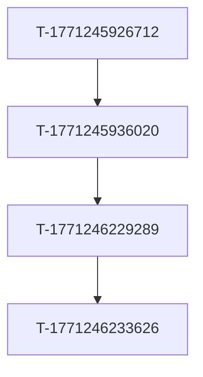

# exarp-go Plan

**Generated:** 2026-02-18

**Status:** draft

**Last updated:** 2026-02-18

**Referenced by:** [wave-task-runner](.cursor/agents/wave-task-runner.md), [wave-verifier](.cursor/agents/wave-verifier.md), [plan-execution](.cursor/rules/plan-execution.mdc)

**Tag hints:** `#planning`

## Agents

| Agent | Role |
|-------|------|
| [wave-task-runner](.cursor/agents/wave-task-runner.md) | Run one task per wave from this plan |
| [wave-verifier](.cursor/agents/wave-verifier.md) | Verify wave outcomes and update status |

---

## Scope

**Purpose:** MCP Server

**Success criteria:** Clear milestones and quality gates; backlog aligned with execution order.

---

## 1. Technical Foundation

- **Project type:** MCP Server
- **Tools:** 28 | **Prompts:** 34 | **Resources:** 21
- **Codebase:** 782 files (Go: 271)
- **Storage:** Todo2 (SQLite primary, JSON fallback)
- **Invariants:** Use Makefile targets; prefer report/task_workflow over direct file edits

**Critical path (longest dependency chain):** T-1771245926712 → T-1771245936020 → T-1771246229289 → T-1771246233626

---

## 2. Backlog Tasks

| Task | Priority | Description |
|------|----------|-------------|
| **T-1771164528145** | high | Add exarp-go cursor run [task-id] and cursor run -p "prompt" to invoke Cursor agent with task or custom prompt from project root. Detect agent on PATH; optional --mode plan-ask-agent, --no-interact... |
| **T-1771252286533** | high | 🎯 **Objective:** Define a general abstraction for "run an agent in another task" so that different agent runtimes (Cursor CLI agent, Cursor Cloud Agent, sub-agent, MCP agent, etc.) can be plugge... |
| **T-1771355107420602000** | high | Add list display for handoffs (like tasks) with cursor, selection, and a detail view when entering a handoff. Reuse tasks-style list/detail pattern from tui.go.  **Acceptance:** Handoffs view shows... |
| **T-1771360298493675000** | high | Fix runIniTermTab: detect ITERM_SESSION_ID to open tab in current iTerm window instead of new window high |
| **T-1771360895822062000** | high | Improve exarp-opencode interaction: add --quiet flag to suppress verbose CLI output high |
| **T-1771360896308433000** | high | Improve exarp-opencode interaction: add --json flag for structured machine-readable output high |
| **T-1771164549862** | medium | Add use_cursor_agent and cursor_agent_prompt params to automation tool. When set, run agent -p in project root and attach output to result. See docs/CURSOR_API_AND_CLI_INTEGRATION.md §3.3. |
| **T-1771171348644** | medium | Phase 6 (MODEL_ASSISTED_WORKFLOW): Add unit tests for all model-assisted components — task_execute, prompt_analyzer, execution_apply. Use mocked model/router so no real LLM required. See docs/MOD... |
| **T-1771171349874** | medium | Phase 6 (MODEL_ASSISTED_WORKFLOW): Add performance benchmarks for model/router and real-model flows. See docs/MODEL_ASSISTED_WORKFLOW.md Phase 6. |
| **T-1771245897653** | medium | 🎯 **Objective:** Fix internal/database comment tests failing with "FOREIGN KEY constraint failed" — comments reference task IDs that don't exist in the test DB.  📋 **Acceptance Criteria:** ... |

---

## 3. Iterative Milestones

Each milestone is independently valuable. Check off as done.

- [ ] **Cursor CLI: add 'cursor run' subcommand Add exarp-go cursor run [task-id] and cursor run -p "prompt" to invoke Cursor agent with task or custom prompt from project root. Detect agent on PATH; optional --mode plan|ask|agent, --no-interactive. See docs/CURSOR_API_AND_CLI_INTEGRATION.md. high** (T-1771164528145)
- [ ] **General agent abstraction for run-agent-in-task** (T-1771252286533)
- [ ] **Handoffs list display and detail view in TUI** (T-1771355107420602000)
- [ ] **Fix runIniTermTab: detect ITERM_SESSION_ID to open tab in current iTerm window instead of new window high** (T-1771360298493675000)
- [ ] **Improve exarp-opencode interaction: add --quiet flag to suppress verbose CLI output high** (T-1771360895822062000)
- [ ] **Improve exarp-opencode interaction: add --json flag for structured machine-readable output high** (T-1771360896308433000)
- [ ] **Automation: optional Cursor agent step Add use_cursor_agent and cursor_agent_prompt params to automation tool. When set, run agent -p in project root and attach output to result. See docs/CURSOR_API_AND_CLI_INTEGRATION.md §3.3. medium** (T-1771164549862)
- [ ] **Unit tests for all components (Phase 6)** (T-1771171348644)
- [ ] **Performance benchmarks (Phase 6)** (T-1771171349874)
- [ ] **Fix database comment tests (FK constraint)** (T-1771245897653)

---

## 4. Recommended Execution Order

1. **T-1771245926712**
2. **T-1771245936020**
3. **T-1771246229289**
4. **T-1771246233626**

**Parallel:** T-1771164528145, T-1771252286533, T-1771355107420602000, T-1771360298493675000, T-1771360895822062000, T-1771360896308433000, T-1771164549862, T-1771171348644, T-1771171349874, T-1771245897653

### Waves (same wave = can run in parallel)

- **Wave 0** (parallel): T-1771164528145, T-1771252286533, T-1771355107420602000, T-1771360298493675000, T-1771360895822062000, T-1771360896308433000, T-1771164549862, T-1771171348644, T-1771171349874, T-1771245897653, T-1771245901197, T-1771245903330, T-1771245906548, T-1771245909201, T-1771245912597, T-1771245913605, T-1771245916585, T-1771245926712, T-1771245929618, T-1771257778074, T-1771354500144133000, T-1771355092457125000, T-1771360821329803000, T-1771360822084869000, T-1771360897057583000, T-1771360897632102000, T-1771361056782987000, T-1771424059130668000, T-1771424064959428000, T-1771426903372815000, T-1771426909351560000, T-1771426910494633000, T-1771426912215029000, T-1768312778714, T-1768318471624, T-1771164550717, T-1771252268378, T-1771424061641133000, T-1771424068541934000, T-1771426909427604000
- **Wave 1** (parallel): T-1771164549623, T-1771278405185, T-1771171357749, T-1771171359038, T-1771171360013, T-1771171361363, T-1771171362298, T-1771171363644, T-1771172717418, T-1771172724534, T-1771245936020, T-1771252276374, T-1771379764381696000, T-1771172735887, T-1771252272139, T-1771252280227
- **Wave 2** (parallel): T-1771278411878, T-1771278414077, T-1771172721983, T-1771172723091, T-1771245933129, T-1771246229289, T-1771280369024605000, T-1771172725704
- **Wave 3:** T-1771246233626

**Full order:** T-1771164528145, T-1771252286533, T-1771355107420602000, T-1771360298493675000, T-1771360895822062000, T-1771360896308433000, T-1771164549862, T-1771171348644, T-1771171349874, T-1771245897653, T-1771245901197, T-1771245903330, T-1771245906548, T-1771245909201, T-1771245912597, T-1771245913605, T-1771245916585, T-1771245926712, T-1771245929618, T-1771257778074, T-1771354500144133000, T-1771355092457125000, T-1771360821329803000, T-1771360822084869000, T-1771360897057583000, T-1771360897632102000, T-1771361056782987000, T-1771424059130668000, T-1771424064959428000, T-1771426903372815000, T-1771426909351560000, T-1771426910494633000, T-1771426912215029000, T-1768312778714, T-1768318471624, T-1771164550717, T-1771252268378, T-1771424061641133000, T-1771424068541934000, T-1771426909427604000, T-1771164549623, T-1771278405185, T-1771171357749, T-1771171359038, T-1771171360013, T-1771171361363, T-1771171362298, T-1771171363644, T-1771172717418, T-1771172724534, T-1771245936020, T-1771252276374, T-1771379764381696000, T-1771172735887, T-1771252272139, T-1771252280227, T-1771278411878, T-1771278414077, T-1771172721983, T-1771172723091, T-1771245933129, T-1771246229289, T-1771280369024605000, T-1771172725704, T-1771246233626

---

## 5. Open Questions

- *(Add open questions or decisions needed during implementation.)*

---

## 6. Out-of-Scope / Deferred

- **T-1771426909427604000** (Optional: dispatcher to enqueue waves on schedule (M5) Cron/scheduler dispatcher: get plan, enqueue next wave(s). Plan M5. low) — low priority
- **T-1771424068541934000** (Protobuf vs JSON benchmarks and serialization tests) — low priority
- **T-1771424061641133000** (Use protojson for Todo2 task protobuf JSON serialization) — low priority
- **T-1768312778714** (Review local commits to identify relevant changes) — low priority
- **T-1771172725704** (Task tool enrichment: CLI --recommended-tools for task update/create) — low priority
- **T-1771252272139** (Optional LocalAI backend (OpenAI-compatible)) — low priority
- **T-1771252280227** (Optional stdio://llm/status resource) — low priority
- **T-1768318471624** (Enhancements Epic) — low priority
- **T-1771164550717** (MCP tool: cursor_cloud_agent (Cloud Agents API) New tool for launch/status/list/follow_up/delete via Cursor Cloud Agents API. Requires CURSOR_API_KEY. See docs/CURSOR_API_AND_CLI_INTEGRATION.md §3.4. low) — low priority
- **T-1771172735887** (Task tool enrichment: optional config for tag-to-tool mapping) — low priority
- **T-1771252268378** (Evaluate langchaingo or Go AI SDK for agentic workflows) — low priority

---

## 7. Key Files / Implementation Notes

- *(Add key files or implementation notes; or leave as placeholder.)*

---

## 8. References

- [docs/BACKLOG_EXECUTION_PLAN.md](docs/BACKLOG_EXECUTION_PLAN.md) — full wave breakdown
- *(Add other plan or doc links as needed.)*
